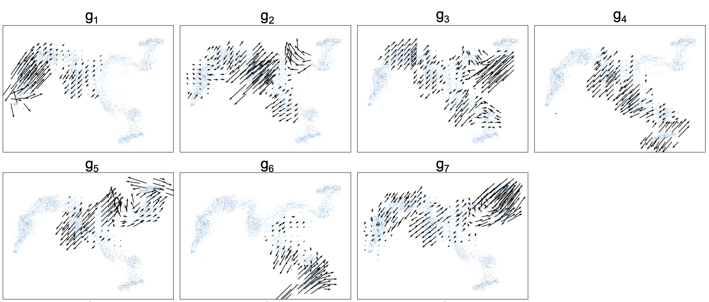
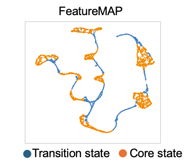

# FeatureMAP: Feature-preserving Manifold Approximation and Projection

Visualizing single-cell data is crucial for understanding cellular heterogeneity and dynamics. Traditional methods like UMAP and t-SNE are effective for clustering but often miss critical gene information. FeatureMAP innovatively combines UMAP and PCA concepts to preserve both clustering structures and gene feature variations within a low-dimensional space.

## Description

FeatureMAP introduces a novel approach by enhancing manifold learning with pairwise tangent space embedding, aiming to retain crucial aspects of cellular data.
We introduce two visualization by FeatureMAP: expression (GEX) and variation (GVA) embedding.
Here is an example over one synthetic dataset with bifurcation model ([BEELINE](https://github.com/Murali-group/Beeline)):


Besides the 2-dimensional visualization, it presents three core concepts:
1. **Gene Contribution**: Estimating and projecting gene feature loadings.
    
2. **Gene Variation Trajectory**: Tracking the differential expression and variation across states.
    
    (Here is the )
    [View 3D Plot](https://YYT1002.github.io/FeatureMAP/figures/3d_plot.html)
    <iframe src="./figures/3d_plot.html" width="600" height="400"></iframe>


3. **Core and Transition States**: Defined computationally through density-preserving capabilities.
    
   

These enhancements allow for differential gene variation analysis, highlighting key regulatory genes that drive transitions between cellular states. Tested on both synthetic and real single-cell RNA sequencing (scRNA-seq) data, including studies on pancreatic development and T-cell exhaustion, FeatureMAP provides a more detailed understanding of cellular trajectories and regulatory mechanisms.


## Getting Started

### Dependencies

- Python 3.8 or higher
- Required Python libraries: numpy, scipy, matplotlib, umap-learn, scikit-learn
- Operating System: Any (Windows, macOS, Linux)

### Installation

### 1. Install directly using pip:

```bash
pip install featuremap-package
```

### 2. Installation via Conda
For users who prefer using Conda, especially for managing complex dependencies and environments in scientific computing.

## How to use FeatureMAP

### Data Visualization
For data vis, similar to UMAP
```

```

Parameters
Outputs

### Gene Contribution

### Gene Trajectory Visualization

### Core and Transition States


## Example data and plots


## Documentation

## Citation
Our FeatureMAP alogrithm is 


## License
The FeatureMAP package is under BSD-3-Clause license.

## Contact

### Acknowledgments
Thanks to the researchers and developers who provided insights and code snippets, including:

