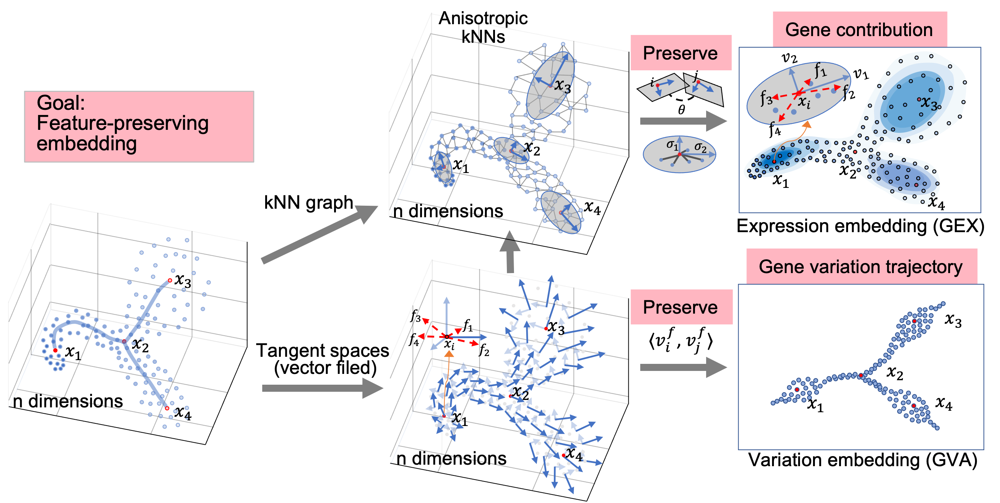

Overview
--------

FeatureMAP: Feature-preserving Manifold Approximation and Projection
--------------------------------------------------------------------
Visualizing single-cell data is crucial for understanding cellular heterogeneity and dynamics. Traditional methods like UMAP and t-SNE are effective for clustering but often miss critical gene information. FeatureMAP innovatively combines UMAP and PCA concepts to preserve both clustering structures and gene feature variations within a low-dimensional space.

Description
-----------

FeatureMAP introduces a novel approach by enhancing manifold learning with pairwise tangent space embedding, aiming to retain crucial aspects of cellular data.
We introduce two visualization by FeatureMAP: expression (GEX) and variation (GVA) embedding.
Here is an example over one synthetic dataset (`BEELINE <https://github.com/Murali-group/Beeline>`_) with bifurcation model. Compared with UMAP, FeatureMAP-GEX better preserves density (similar to densMAP), and FeatureMAP-GVA shows trajectories.

.. image::../figures/bifurcation_embedding.png
   :alt: Bifurcation Embedding

Besides the 2-dimensional visualization, FeatureMAP presents three core concepts:

1. **Gene Contribution**: Estimating and projecting gene feature loadings. The arrow represents the direction and magnitude of one gene's change. 

   .. image:: ../figures/gene_contribution.png
      :alt: Gene Contribution

2. **Gene Variation Trajectory**: Tracking the cell differentiation across states. There are clear paths (transition states) connecting cell states (core states) in a knot-and-thread way.

   .. image:: ../figures/gene_variation_trajectory.png
      :alt: Gene Variation Trajectory

   `View 3D Plot <https://YYT1002.github.io/FeatureMAP/figures/3d_plot.html>`_

3. **Core and Transition States**: Defined computationally through cell density and cell variation properties. Core states are cells with higher cell density and smaller cell variation, while transition states are lower cell density and larger cell variation.

   .. image:: ../figures/core_trans_states.png
      :alt: Core and Transition States

These enhancements allow for differential gene variation analysis, highlighting key regulatory genes that drive transitions between cellular states. Tested on both synthetic and real single-cell RNA sequencing (scRNA-seq) data, including studies on pancreatic development and T-cell exhaustion, FeatureMAP provides a more detailed understanding of cellular trajectories and regulatory mechanisms.

Getting Started
---------------

Dependencies
~~~~~~~~~~~~

- Python 3.8 or higher
- Required Python libraries: numpy, scipy, matplotlib, umap-learn, scikit-learn
- Operating System: Any (Windows, macOS, Linux)

Installation
~~~~~~~~~~~~

1. Install directly using pip:

   .. code-block:: bash

      pip install featuremap-package

2. Installation via Conda
   For users who prefer using Conda, especially for managing complex dependencies and environments in scientific computing.

How to use FeatureMAP
---------------------

Data Visualization
------------------

For data vis, similar to UMAP

Parameters
~~~~~~~~~~

Outputs
~~~~~~~

Gene Contribution
~~~~~~~~~~~~~~~~~

Gene Trajectory Visualization
~~~~~~~~~~~~~~~~~~~~~~~~~~~~~

Core and Transition States
~~~~~~~~~~~~~~~~~~~~~~~~~~

Example data and plots
~~~~~~~~~~~~~~~~~~~~~~

Documentation
-------------

Citation
--------

Our FeatureMAP algorithm is 

License
-------

The FeatureMAP package is under BSD-3-Clause license.

Contact
-------

Acknowledgments
----------------

Thanks to the researchers and developers who provided insights and code snippets, including:
